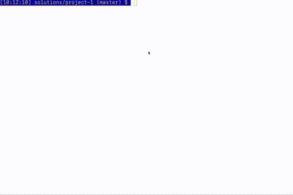

# COP 3530 - Data Structures and Algorithms I 
# Project 1 
## Due: Friday, February 1st 11:59 P.M. CST 

## Objective: 
This project is meant to help you review concepts of programming in C++ while also getting used to the environment for this course.
In this project, you are asked to create a game called Numerical Wagers.
You will need to be able to perform basic file input, create classes, and manipulate basic data structures in C++.
You will also need to create a Makefile to compile your program.
Information about creating Makefiles is in your Zybook.

## Problem Description: 
You will be given files in the following format (See [questions.txt](questions.txt) for an example):
```
numerical_answer1 question1
numerical_answer2 question2
numerical_answer3 question3
numerical_answer4 question4
```
 
Each line of the file composes a question and answer first, with the answer first for easier file handling.
A file can contain any number of questions and answers.
Questions can be made up of multiple words.
Answers will be a single integer value.
You will need to create a class for holding each question and answer pair.
As you read the file, you will create a new object for the question and answer pair and then place it into a vector.
The game will use these questions and answers as the puzzles for the game of Numerical Wagers.
You will need to select one of the questions from the vector.

The idea behind the game is to be able to guess the answer to the question by guessing each digit in the number.
You are allowed two missed guesses.
If a player guesses an incorrect digit, then they have one less missed guess that they can make.
If a player guesses a correct digit, then they can make the next guess without any penalties.
Players will start with 200 points.
To make the game more interesting, for each question, the player will have to wager a points.
If the player can guess the complete numerical answer (all the digits in the number), then they win the wagered number of points.
Otherwise, they lose all points.
The game is over after three rounds or after the player runs out of points (in which case they lose).
They can then either choose to start another game or quit the game.   
 
## Creating the Game 
You are required to two classes (Wagers and Question), and a main.cpp.
The class Question keeps track of information for a question and answer pair, the class Wagers contains the logic for your game, and the file main.cpp is the main entry point for your program.
Each class should be divided into a .cpp and .h file.
Upon the start of the game, your terminal should display the following:
```
Welcome to Numerical Wagers!
Please enter the name of the file containing your questions:
```
 
The player will then type the name of a file with their questions into the terminal.
Afterward, the screen should look similar to the following:
```
Welcome to Numerical Wagers!
Please enter the name of the file containing your questions: questions.txt
        	
Round 1
Next Question: Number of years in a score
Current Points: 200
Please make a wager:
```
 
This shows the player the next question that will be asked. At this point, the player must enter a wager of points between 1 and their current points (in this case 200).
The screen will then look like:
 
```
Current Question: Number of years in a score
Current Answer: _ _
Missed Guesses: 0
Please guess a digit:
```
 
We will use the character '\_' to indicate a missing digit.
"Missed Guesses" refers to the number of missed guesses that the player has (maximum 2).
The player is being prompted to enter a possible digit.
At this point, one of two things should happen.
Either the player guesses a correct digit or they guess an incorrect digit.
For simplicity, you may assume that the player will only guess digits and that no other inputs will be entered (this is not a safe assumption in real world applications!).
 
If they make a correct guess, the screen will look like this:
 
 ```
Current Question: Number of years in a score
Current Answer: _ _
Missed Guesses: 0
Please guess a digit:2
 
Current Question: Number of years in a score
Current Answer: 2 _
Missed Guesses: 0
Please guess a digit:
```
 
If they make an incorrect guess, the screen will look like this:
 
```
Current Question: Number of years in a score
Current Answer: _ _
Missed Guesses: 0
Please guess a digit:4
 
Current Question: Number of years in a score
Current Answer: _ _
Missed Guesses: 1
Please guess a digit:
```
 
The round will proceed in this way until either they correctly guess all digits in the answer or until they made 2 missed guesses.
At which time, the game should show the player the wager screen again with either their points earned or lost:
 
```
Round 2
Next Question: Number of bones in the human body
Current Points: 220
Please make a wager:
```
 
The game will end after either 3 rounds or after the player has ran out of points.
At this point, the game should give the final score and prompt the player to either play again or quit:
 
```
Final points: 0
Would you like to:
1. Play a new game
2. Quit the game
Please make a selection:
```
 
If the player chooses to play a new game, the game will prompt the player to enter a new file as they did when first running the program.

## Sample run


## Code Organization for Numerical Wagers
You will need to make sure that your code meets the following specifications:
 
## The Main File
Your main file handles all display messages, running the game, and taking in user input.
Separating the logic that displays the menus to the player from the game of Numerical Wagers allows us to reuse the existing Numerical Wagers game in different programs or to change out our current view for a new one if we so choose.

## Breakdown of Grades:    
You will find a rubric for the project in Canvas. 

## Submission Instructions: 
Make sure that your build succeeds when you push it to Github. There is information for how to do this on Canvas with an attached video.
Make sure that your project follows all requirements under code organization.
